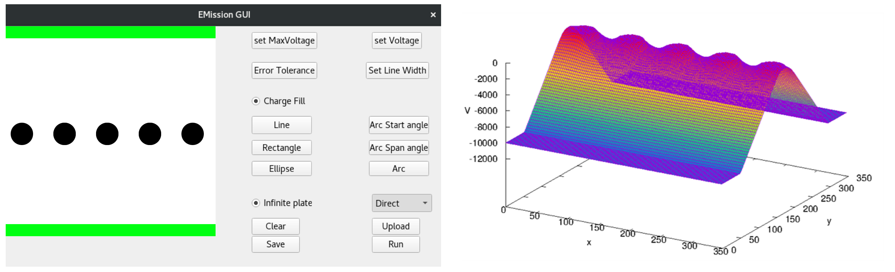

# Emission
Emission is a project which takes in user-defined geometries and charges and
uses the Laplace Equation to plot potential and electric fields. There are two
methods to calculate the fields, one is the iterative method and relies on FDTD
techniques and the other is the direct method which depends on sparse matrix
computations performed by BLAS libraries. 

The GUI is written in Qt and the plots are generated through Gnuplot.

A more detailed performance and analysis report can be found in the repository,
'ProjectReport.pdf'

## Build Instructions:

### Dependencies:

* Qt5 development toolkit
* SuperLU
* ATLAS
* Gnuplot with gnuplot-qt

### Installation

1. Install dependencies
2. Change directory to source/direct_method/

    a. Change the path of slu_ddef.h specified in fpstar.h to it's location
    on your system.

    b. Change source/direct_method/Makefile LDFLAGS to point to the locations
    of the SuperLU and ATLAS libraries on your system.

    c. Run make. Move the compiled executable fpstar.out to source/main/

3. Change directory to source/main/

    d. In source/main/ qmake on the file Emission.pro such as qmake
    Emission.pro. Note that qmake might be called qmake-qt5 or some variation
    thereof on your computer.

    e. Once the Makefile has been generated in the source/main directory run
    make again.

    f. The finished Emission executable can now be run. Note that it must be
    kept in the same directory as fpstar.out for the direct method to work.

### Acknowledgements
We would like to acknowledge the use of [SuperLU](https://github.com/xiaoyeli/superlu), [CSPARSE](https://people.sc.fsu.edu/~jburkardt/c_src/csparse/csparse.html), and the [stb image library](https://github.com/nothings/stb) in our project.
